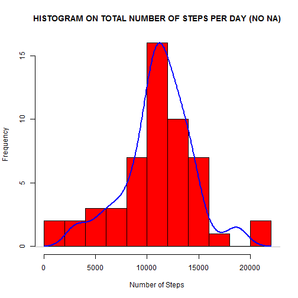
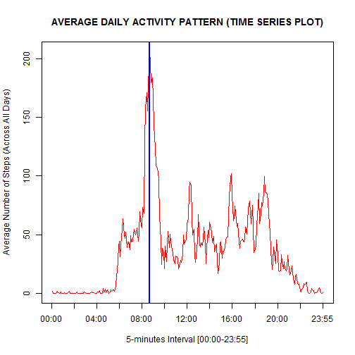
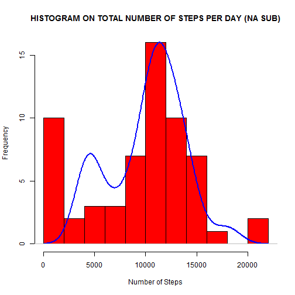
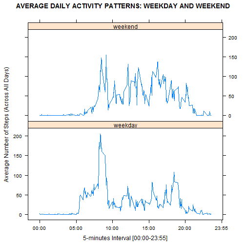

Reproducible Research: Peer Assessment 1
========================================

## 1. The Data
The data have been collected from a personal activity monitoring device:
it obtains them at 5-minute intervals through out the day. The data consists of:

* **steps**: number of steps taking in a 5-minute interval (missing values as NA);
* **date**: the data on which the measurement was taken (YYYY-MM-DD format);
* **interval**: identifier for the 5-minute interval in which measurement was taken.

The dataset has stored in a comma-separated-value (CSV) file and there are a total
of 17568 observations in this dataset, collected during October/November 2012.


## 2. Loading and preprocessing the data
From the work directory (remember that to re-run the code, change the work directory 
with **_setwd()_** ), the data have been loaded and their format has been showed:


```r
data <- read.csv("activity.csv",colClasses = c("numeric", "Date", "numeric"))
head(data)
```

```
##   steps       date interval
## 1    NA 2012-10-01        0
## 2    NA 2012-10-01        5
## 3    NA 2012-10-01       10
## 4    NA 2012-10-01       15
## 5    NA 2012-10-01       20
## 6    NA 2012-10-01       25
```

A variable named **time** (with **_strptime()_** ) has been added and its format 
has been showed after having used **_format()_** to get only hours and minutes:


```r
data$time <- strptime(paste(data$date, sapply(data$interval, formatC, width = 4, 
                                              flag = 0)), format = "%Y-%m-%d %H%M")
data$time <- format(data$time,format="%H:%M")
head(data)
```

```
##   steps       date interval  time
## 1    NA 2012-10-01        0 00:00
## 2    NA 2012-10-01        5 00:05
## 3    NA 2012-10-01       10 00:10
## 4    NA 2012-10-01       15 00:15
## 5    NA 2012-10-01       20 00:20
## 6    NA 2012-10-01       25 00:25
```


## 3. Mean and median total number of steps taken per day
Ignoring rows with missing values and showing a little example,


```r
data_eff <- na.omit(data)
head(data_eff)
```

```
##     steps       date interval  time
## 289     0 2012-10-02        0 00:00
## 290     0 2012-10-02        5 00:05
## 291     0 2012-10-02       10 00:10
## 292     0 2012-10-02       15 00:15
## 293     0 2012-10-02       20 00:20
## 294     0 2012-10-02       25 00:25
```

an histogram of the total number of steps taken per day has been performed:


```r
data_eff_sum <- tapply(data_eff$steps,data_eff$date,sum)
hist(data_eff_sum,breaks = ceiling(max(data_eff_sum)/2500),col="red",
     main = "HISTOGRAM ON TOTAL NUMBER OF STEPS PER DAY (NO NA)",
     xlab = "Number of Steps",ylab = "Frequency")
par(new=TRUE)
plot(density(data_eff_sum),col = "blue",lwd = 2,axes=FALSE,main="",xlab="",ylab="")
```

 

Moreover, statistical summary has been calculated (with 5 digits for a better precision):


```r
summary(data_eff_sum,digits=5)
```

```
##    Min. 1st Qu.  Median    Mean 3rd Qu.    Max. 
##      41    8841   10765   10766   13294   21194
```

pointing out that mean and median differ for only 1 steps, almost the same value.


## 4. Average daily activity pattern
A time series plot of the 5-minute interval and the average number of steps taken (averaged across all days) has been shown:


```r
data_eff_mean <- tapply(data_eff$steps,data_eff$time,mean)
plot(data_eff_mean,type="l",col="red",xaxt="n",
     xlab = "5-minutes Interval [00:00-23:55]",
     ylab = "Average Number of Steps (Across All Days)",
     main = "AVERAGE DAILY ACTIVITY PATTERN (TIME SERIES PLOT)")
axis(1,seq(0,length(data_eff_mean),length(data_eff_mean)/12),
     labels = names(data_eff_mean[c(seq(1,length(data_eff_mean),
              length(data_eff_mean)/12),length(data_eff_mean))]) )
abline(v = match(data_eff_mean[data_eff_mean==max(data_eff_mean)],data_eff_mean),
       lwd = 2, col = "blue")
```

 

and the maximum number of steps is contained in 5-minute interval:


```r
data_eff_mean[data_eff_mean==max(data_eff_mean)]
```

```
## 08:35 
## 206.2
```

as it is possible to see from **blue line** in the previous graphic.


## 5. Imputing missing values
The presence of several missing value ("NA") can introduce a data polarization. 
In this dataset there are


```r
nrow(data)-nrow(data_eff)
```

```
## [1] 2304
```

number of steps _not available_ that might be replaced with a robust strategy.
In order to do that, they have been used **medians** calculated for every 5-minute 
intervals and a supporting variable **_aux_** has been used in a **_for-statement_**:


```r
new_data <- data
new_data_median <- tapply(data$steps,data$time,median,na.rm=TRUE)
for(k in 1:length(new_data_median)){
    aux <- new_data[names(new_data_median[k]) == new_data$time,]
    aux$steps[is.na(aux$steps)] <- new_data_median[k]
    new_data[rownames(aux),] <- aux
}
```

The process works well; as example, it has been taken the interval "08:15" median and its insertion has been showed:


```r
new_data_median[names(new_data_median)=="08:15"]
```

```
## 08:15 
##    13
```

```r
#before (data)
data$steps[names(new_data_median)=="08:15"]
```

```
##  [1]  NA   0   0 522 122 149  27  NA 743   0 743 687   0  25  22 758 652
## [18] 759   0   0   0  13  15   0   0   0  62 533  23  75   0  NA 753  32
## [35]  NA   7   0 393   0  NA  NA 179   0   0  NA   0   0   0   0  13   0
## [52] 679   0   0  28  70  25   0   0 240  NA
```

```r
#after (new_data)
new_data$steps[names(new_data_median)=="08:15"]
```

```
##  [1]  13   0   0 522 122 149  27  13 743   0 743 687   0  25  22 758 652
## [18] 759   0   0   0  13  15   0   0   0  62 533  23  75   0  13 753  32
## [35]  13   7   0 393   0  13  13 179   0   0  13   0   0   0   0  13   0
## [52] 679   0   0  28  70  25   0   0 240  13
```

Redoing §3 analysis (histogram, mean and median) in order to detect the difference:


```r
new_data_sum <- tapply(new_data$steps,new_data$date,sum)
hist(new_data_sum,breaks = ceiling(max(new_data_sum)/2500),col="red",
     main = "HISTOGRAM ON TOTAL NUMBER OF STEPS PER DAY (NA SUB)",
     xlab = "Number of Steps",ylab = "Frequency")
par(new=TRUE)
plot(density(new_data_sum),col = "blue",lwd = 2,axes=FALSE,main="",xlab="",ylab="")
```

 


```r
summary(new_data_sum,digits=5)
```

```
##    Min. 1st Qu.  Median    Mean 3rd Qu.    Max. 
##      41    6778   10395    9504   12811   21194
```

highlighting that imputing missing data change both median (less) and mean (less), with the density line (in blue) become bimodal. Probably, that is caused by a great quantity of 0 steps values inserted in first and last day hours, as you can see from median variable:


```r
new_data_median
```

```
## 00:00 00:05 00:10 00:15 00:20 00:25 00:30 00:35 00:40 00:45 00:50 00:55 
##     0     0     0     0     0     0     0     0     0     0     0     0 
## 01:00 01:05 01:10 01:15 01:20 01:25 01:30 01:35 01:40 01:45 01:50 01:55 
##     0     0     0     0     0     0     0     0     0     0     0     0 
## 02:00 02:05 02:10 02:15 02:20 02:25 02:30 02:35 02:40 02:45 02:50 02:55 
##     0     0     0     0     0     0     0     0     0     0     0     0 
## 03:00 03:05 03:10 03:15 03:20 03:25 03:30 03:35 03:40 03:45 03:50 03:55 
##     0     0     0     0     0     0     0     0     0     0     0     0 
## 04:00 04:05 04:10 04:15 04:20 04:25 04:30 04:35 04:40 04:45 04:50 04:55 
##     0     0     0     0     0     0     0     0     0     0     0     0 
## 05:00 05:05 05:10 05:15 05:20 05:25 05:30 05:35 05:40 05:45 05:50 05:55 
##     0     0     0     0     0     0     0     0     0     0     0     0 
## 06:00 06:05 06:10 06:15 06:20 06:25 06:30 06:35 06:40 06:45 06:50 06:55 
##     0     0     0     0     0     0     0     0     0     0     8    13 
## 07:00 07:05 07:10 07:15 07:20 07:25 07:30 07:35 07:40 07:45 07:50 07:55 
##     7    13    14     0     0    12     0     0    15    19    19    28 
## 08:00 08:05 08:10 08:15 08:20 08:25 08:30 08:35 08:40 08:45 08:50 08:55 
##    41    25    32    13    45    33    37    19    51    60    16    43 
## 09:00 09:05 09:10 09:15 09:20 09:25 09:30 09:35 09:40 09:45 09:50 09:55 
##    20     8    31    15    16     0     0     0     0     0     0     0 
## 10:00 10:05 10:10 10:15 10:20 10:25 10:30 10:35 10:40 10:45 10:50 10:55 
##     0     0     0     0     0     0     0     0     0     0     0     0 
## 11:00 11:05 11:10 11:15 11:20 11:25 11:30 11:35 11:40 11:45 11:50 11:55 
##     0     0     0     0     0     0     0     0     0     0     0     0 
## 12:00 12:05 12:10 12:15 12:20 12:25 12:30 12:35 12:40 12:45 12:50 12:55 
##     0     0     6    10     0     0     0     0     0     0     0     0 
## 13:00 13:05 13:10 13:15 13:20 13:25 13:30 13:35 13:40 13:45 13:50 13:55 
##     0     0     0     0     0     0     0     0     0     0     0     0 
## 14:00 14:05 14:10 14:15 14:20 14:25 14:30 14:35 14:40 14:45 14:50 14:55 
##     0     0     0     0     0     0     0     0     0     0     0     0 
## 15:00 15:05 15:10 15:15 15:20 15:25 15:30 15:35 15:40 15:45 15:50 15:55 
##     0     0     0     0     0     0     0     0     0     0     0     0 
## 16:00 16:05 16:10 16:15 16:20 16:25 16:30 16:35 16:40 16:45 16:50 16:55 
##     0     0     0     0     0     0     0     0     0     0     0     0 
## 17:00 17:05 17:10 17:15 17:20 17:25 17:30 17:35 17:40 17:45 17:50 17:55 
##     0     0     0     7     7     0     7     7    26     7     0    10 
## 18:00 18:05 18:10 18:15 18:20 18:25 18:30 18:35 18:40 18:45 18:50 18:55 
##    15    18    26    25    24     9    33    26    34    42    33    30 
## 19:00 19:05 19:10 19:15 19:20 19:25 19:30 19:35 19:40 19:45 19:50 19:55 
##    33    30     8     8     7     0     0     0     0     0     0     0 
## 20:00 20:05 20:10 20:15 20:20 20:25 20:30 20:35 20:40 20:45 20:50 20:55 
##     0     0     0     0     0     0     0     0     0     0     0     0 
## 21:00 21:05 21:10 21:15 21:20 21:25 21:30 21:35 21:40 21:45 21:50 21:55 
##     0     0     0     0     0     0     0     0     0     0     0     0 
## 22:00 22:05 22:10 22:15 22:20 22:25 22:30 22:35 22:40 22:45 22:50 22:55 
##     0     0     0     0     0     0     0     0     0     0     0     0 
## 23:00 23:05 23:10 23:15 23:20 23:25 23:30 23:35 23:40 23:45 23:50 23:55 
##     0     0     0     0     0     0     0     0     0     0     0     0
```


## 6. Differences in activity pattern between weekdays and weekends
With the help of **_weekdays()_**, it has been create a new factor variable in the dataset (the one with the filled-in missing values) to indicate if a day is a weekday or a weekend day. **_Sys.setlocale()_** has been used to get name of days in English and an example has been showed:


```r
Sys.setlocale("LC_TIME","English")
```

```
## [1] "English_United States.1252"
```

```r
new_data$day <- weekdays(new_data$date,abbreviate = "TRUE")
new_data$week <- as.factor(ifelse(new_data$day %in% c("Sat","Sun"),"weekend","weekday"))
# an example
new_data[1430:1450,]
```

```
##      steps       date interval  time day    week
## 1430     0 2012-10-05     2305 23:05 Fri weekday
## 1431     0 2012-10-05     2310 23:10 Fri weekday
## 1432     0 2012-10-05     2315 23:15 Fri weekday
## 1433     0 2012-10-05     2320 23:20 Fri weekday
## 1434     0 2012-10-05     2325 23:25 Fri weekday
## 1435     0 2012-10-05     2330 23:30 Fri weekday
## 1436     0 2012-10-05     2335 23:35 Fri weekday
## 1437     0 2012-10-05     2340 23:40 Fri weekday
## 1438     0 2012-10-05     2345 23:45 Fri weekday
## 1439     0 2012-10-05     2350 23:50 Fri weekday
## 1440     0 2012-10-05     2355 23:55 Fri weekday
## 1441     0 2012-10-06        0 00:00 Sat weekend
## 1442     0 2012-10-06        5 00:05 Sat weekend
## 1443     0 2012-10-06       10 00:10 Sat weekend
## 1444     0 2012-10-06       15 00:15 Sat weekend
## 1445     0 2012-10-06       20 00:20 Sat weekend
## 1446     0 2012-10-06       25 00:25 Sat weekend
## 1447     0 2012-10-06       30 00:30 Sat weekend
## 1448     0 2012-10-06       35 00:35 Sat weekend
## 1449     0 2012-10-06       40 00:40 Sat weekend
## 1450     0 2012-10-06       45 00:45 Sat weekend
```

For a graphical difference between weekdays and weekends, **_lattice_** package has been used to perform a time series plot of the 5-minute interval and the average number of steps taken (averaged across all weekdays/weekend days):


```r
library(lattice)
new_data_mean <- aggregate(new_data$steps ~ new_data$interval+new_data$week, FUN="mean")
colnames(new_data_mean) <- c("interval","week","meanSteps")
len = length(new_data_mean$interval)/2
xyplot(new_data_mean$meanSteps~new_data_mean$interval|new_data_mean$week,
       data = new_data_mean,type = "l",layout=c(1,2),
       main = "AVERAGE DAILY ACTIVITY PATTERNS: WEEKDAY AND WEEKEND",
       xlab = "5-minutes Interval [00:00-23:55]",
       ylab = "Average Number of Steps (Across All Days)",
       scales = list(x = list(
                     labels = c("","00:00","05:00","10:00","15:00","20:00","23:55"))) )
```

 

